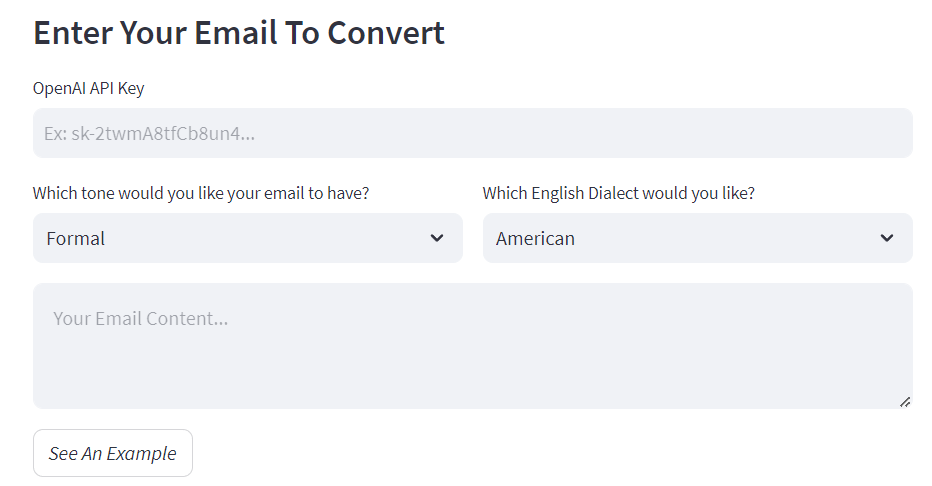

# Email Tonifier ✉️

> This application is powered by Streamlit and LangChain which serves as a user-friendly web tool for enhancing professional email communication by refining tone, format, and dialect.

You can access the deployed application: [Live App](https://email-tonifier.streamlit.app/)

Demo Video (Screencast): [Demo](https://www.youtube.com/)


## About the Project 🧾

Email Tonifier is a tool designed to empower professionals by transforming their emails into polished and professional communications, addressing the common challenge of crafting well-structured and appropriately toned messages.

## Technologies used 🧑‍💻

- [Streamlit](https://streamlit.io/)
- [LangChain](https://python.langchain.com/docs/get_started/introduction)
- [OpenAI](https://openai.com/)
- [Python](https://www.python.org/)



## **How to use 📦**

1. Clone the repository to your local machine:

```
https://github.com/aman-chhetri/Email-Tonifier.git
```

2. Navigate to the project directory:

```
cd Email-Tonifier
```

3. Install the required dependencies: 

```
pip install streamlit
```

4. Run the Streamlit app:

```
streamlit run main.py
```

## Contact 📩
Made by: [@amankshetri](https://www.linkedin.com/in/amankshetri/) - feel free to contact me! 🙂
